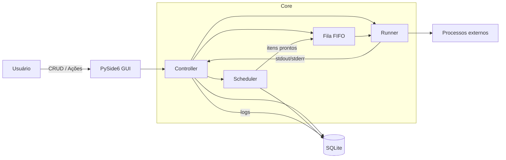

# Orchestrador de RPA (Python + UiPath)

[](#requisitos)
[](#testes)
[](LICENSE)

Orquestrador local para automações (RPA) no Windows, com interface gráfica (PySide6), cadastro de processos em SQLite e execução sequencial com fila.

Este repositório contém **código executável** (não apenas documentação conceitual): você consegue cadastrar processos, agendar execuções, acompanhar console/logs e exportar histórico.

## Sumário

- [Resumo Executivo](#resumo-executivo)
- [O Problema](#o-problema)
- [A Solução](#a-solução)
- [Arquitetura](#arquitetura)
- [Recursos](#recursos)
- [Requisitos](#requisitos)
- [Como Rodar (GUI)](#como-rodar-gui)
- [Configuração](#configuração)
- [Execução de Processos](#execução-de-processos)
- [Logs e Exportação](#logs-e-exportação)
- [Testes](#testes)
- [Solução de Problemas](#solução-de-problemas)
- [Estrutura do Projeto](#estrutura-do-projeto)
- [Contribuições](#contribuições)

## Resumo Executivo

Em ambientes com múltiplas rotinas automatizadas, o desafio recorrente é transformar tarefas isoladas em uma **operação previsível**: agendamento, fila, execução ordenada, rastreabilidade e recuperação quando algo falha.

Este orquestrador foi desenhado para ser uma camada simples e prática de operação local:

- cadastro de processos (UiPath ou scripts/atalhos) em SQLite
- agendamento baseado em regras (ano, mês, semana, dia, hora, minuto)
- fila FIFO com execução sequencial
- console (stdout/stderr) e logs persistidos, com exportação por período

## O Problema

Sem um orquestrador, é comum ocorrer:

- execuções manuais e sem padronização
- falta de rastreabilidade (o que rodou, quando, com que saída)
- duplicidade de execuções no mesmo horário
- dependência de pessoas e baixa previsibilidade

## A Solução

O projeto combina GUI + scheduler + executor, mantendo uma superfície operacional simples:

- a GUI permite gerenciar processos e observar execução
- o scheduler verifica periodicamente o que está “na hora” e enfileira
- o executor consome a fila, executa e registra logs

## Arquitetura

### Visão macro (componentes)



## Recursos

- GUI com dashboard (agenda do dia, fila, executando agora)
- Cadastro/edição/exclusão e habilitar/desabilitar processos no SQLite
- Scheduler com verificação a cada 60s no horário 07:00–18:00
- Proteção contra duplicidade: não enfileira o mesmo processo mais de uma vez no mesmo minuto
- Execução sequencial (FIFO)
- Logs persistidos no SQLite e exportação por período (CSV/TXT)
- Console na GUI para acompanhar stdout/stderr em tempo real

## Requisitos

- Windows (recomendado)
- Python 3.10+
- Dependências em [requirements.txt](requirements.txt)

## Como Rodar (GUI)

1. Criar e ativar ambiente virtual

```powershell
python -m venv .venv
& .\.venv\Scripts\Activate.ps1
```

2. Instalar dependências

```powershell
pip install -r requirements.txt
```

3. Executar a aplicação

```powershell
python src\gui_app.py
```

## Configuração

### Variáveis de ambiente

- `ORCH_DB_PATH`: caminho do arquivo SQLite (opcional). Se não definido, usa `orch.sqlite3` no diretório atual.

Exemplo (PowerShell):

```powershell
$env:ORCH_DB_PATH = "C:\caminho\orch.sqlite3"
```

### Locale (meses/dias da semana)

Os nomes de mês e dia da semana usados no agendamento dependem do **locale** do sistema/Python (ex.: `December` vs `Dezembro`). Em geral, no Windows a aplicação tenta alinhar com o idioma do sistema.

Para inspecionar o que o Python está retornando no seu ambiente:

```powershell
python -c "import time; print(time.strftime('%B'), time.strftime('%A'))"
```

## Execução de Processos

O executor monta e executa o comando conforme a ferramenta/extensão do caminho cadastrado.

### UiPath

Para processos UiPath, o comando usado é:

```text
<robot_path> execute --process-name <Nome_Processo>
```

### Scripts e executáveis

O campo de caminho pode apontar para um executável/script. O comportamento é:

- `.py` / `.pyw`: executa com o Python do ambiente ativo
- `.bat` / `.cmd`: executa via `cmd.exe /c`
- `.ps1`: executa via PowerShell (`-ExecutionPolicy Bypass`)
- `.lnk`: executa via `Start-Process -Wait`
- `.exe`: executa diretamente

Se o caminho apontar para um arquivo não executável no Windows (ex.: `.txt`), o orquestrador gera um erro explicando o motivo.

### Cancelamento de execução

O cancelamento foi desenhado para ser conservador: por regra, está disponível apenas para execuções Python (para evitar interromper ferramentas externas sem controle).

## Logs e Exportação

- Os logs são exibidos na GUI e persistidos no SQLite.
- A aba “Logs” permite exportar por período para CSV ou TXT.

## Testes

Para rodar os testes unitários:

```powershell
pytest -q
```

## Solução de Problemas

### Nada executa, mesmo com horário correto

- Confirme o horário do scheduler: o sistema só agenda entre 07:00 e 18:00.
- Valide o locale (mês/dia da semana) com o comando abaixo e ajuste o cadastro para bater exatamente:

```powershell
python -c "import time; print(time.strftime('%B'), time.strftime('%A'))"
```

### Erro ao executar .bat/.ps1/.lnk

- Verifique permissões e caminhos com espaço.
- Para PowerShell, garanta que o script não dependa de profile.
- Para atalhos `.lnk`, confirme que o alvo existe e é acessível pelo usuário.

### Banco SQLite não aparece onde você espera

- Se `ORCH_DB_PATH` não estiver definido, o arquivo padrão é criado no diretório de execução.
- Recomenda-se definir `ORCH_DB_PATH` com caminho absoluto para evitar dúvidas.

## Estrutura do Projeto

- [src/gui_app.py](src/gui_app.py): aplicação GUI (entrypoint).
- [src/gui_controller.py](src/gui_controller.py): controller (scheduler/execução/logs).
- [src/orchestrator.py](src/orchestrator.py): scheduler e fila.
- [src/executor.py](src/executor.py): montagem/execução de comandos.
- [src/db.py](src/db.py): persistência SQLite.
- [src/models.py](src/models.py): modelos de dados.
- [src/util.py](src/util.py): regras de agendamento.
- [tests/](tests/): testes unitários (pytest).

## Contribuições

Contribuições são bem-vindas.

- Abra uma issue descrevendo o problema/necessidade
- Para mudanças maiores, descreva a proposta e trade-offs
- Inclua testes quando fizer sentido
